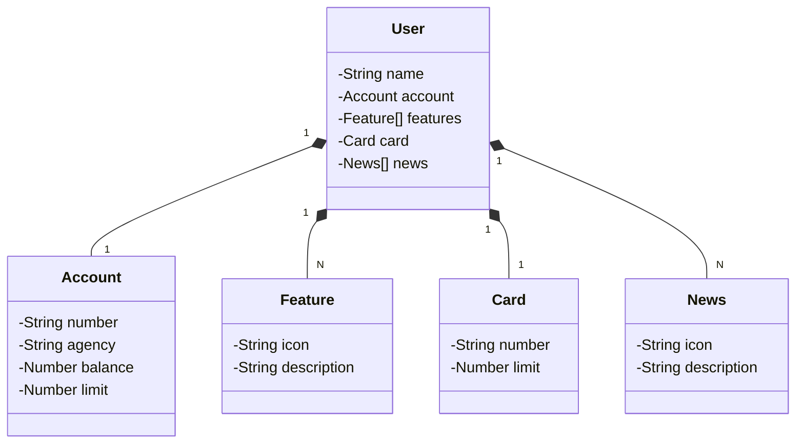

# DIO CLARO BOOTCAMP 2024 Java API
   

Esta é uma RESTful API construída em Java 17 com Spring Boot 3, desenvolvida como objeto de estudo e desafio para o DIO Claro Bootcamp 2024. A API permite a criação de usuários de uma instituição bancária, fornecendo informações como nome, agência e número da conta do cliente, detalhes do cartão (número e limite), além de funcionalidades e notícias com ícones associados. Ela armazena os dados no banco de dados e conta com tratamento de exceções para evitar erros e garantir respostas consistentes.

## Principais Tecnologias
- **Java 17**: Utilizaremos a versão LTS mais recente do Java para tirar vantagem das últimas inovações que essa linguagem robusta e amplamente utilizada oferece;
- **Spring Boot 3**: Trabalharemos com a mais nova versão do Spring Boot, que maximiza a produtividade do desenvolvedor por meio de sua poderosa premissa de autoconfiguração;
- **Spring Data JPA**: Exploraremos como essa ferramenta pode simplificar nossa camada de acesso aos dados, facilitando a integração com bancos de dados SQL;
- **OpenAPI (Swagger)**: Vamos criar uma documentação de API eficaz e fácil de entender usando a OpenAPI (Swagger), perfeitamente alinhada com a alta produtividade que o Spring Boot oferece;
- **Railway**: facilita o deploy e monitoramento de nossas soluções na nuvem, além de oferecer diversos bancos de dados como serviço e pipelines de CI/CD.

## [Link do Figma](https://www.figma.com/file/0ZsjwjsYlYd3timxqMWlbj/SANTANDER---Projeto-Web%2FMobile?type=design&node-id=1421%3A432&mode=design&t=6dPQuerScEQH0zAn-1)

O Figma foi utilizado para a abstração do domínio desta API, sendo útil na análise e projeto da solução.

## Diagrama de Classes (Domínio da API)

## Documentação da API (Swagger)

### [https://sdw-2023-prd.up.railway.app/swagger-ui.html](https://sdw-2023-prd.up.railway.app/swagger-ui.html)

Esta API ficará disponível no Railway por um período de tempo limitado, mas este é um código-fonte aberto. Portanto, sintam-se à vontade para cloná-lo, modificá-lo (já que é um bom projeto base para novos projetos) e executar localmente ou onde achar mais interessante! Só não esquece de marcar a gente quando divulgar a sua solução 🥰
